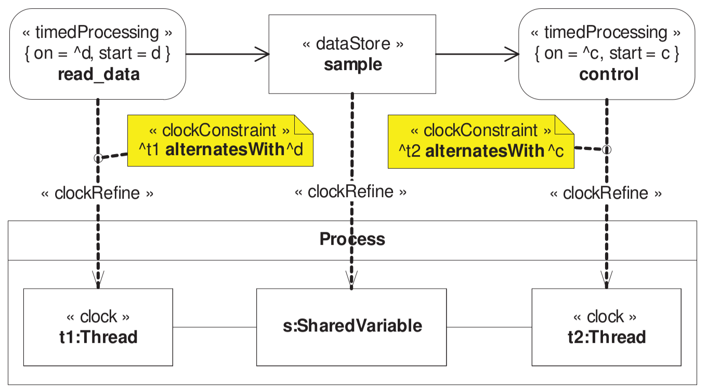
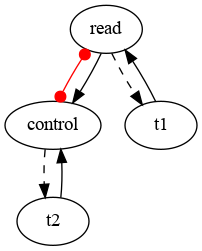
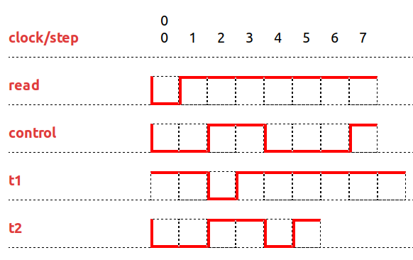

# AADL example

Example taken from FDL 2007.

The CCSL specification is [simple](lc/aadl1.lc).

Looking at causality graph with identify that the specification is not safe since the counter-arc (in red) is not in a cycle.

A simple interactive execution is given below:

 

But computing the [Synchronous Transition Systems](sts/Aadl1.dot.png) results in  39 states and 949 transitions.

- [FDL2007](https://hal.inria.fr/inria-00204484/): F. Mallet, C. André, R. de Simone: *Modeling of immediate vs. delayed data communications: from AADL to UML Marte.* FDL 2007: 249-254.

