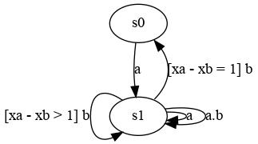
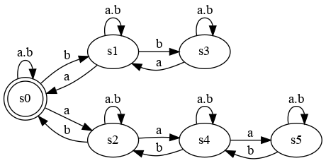
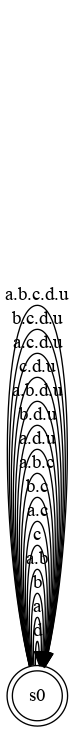

# Demo of CCSL Primitives

Take all the primitives of CCSL and use the tool to illustrate their semantics

### Precedence

[src](lc/Precedes.lc) [simul](vcd/prec.html)

- **Precedence** is an asynchronous primitive that forces one clock to precede another one, it will therefore remains ahead or in advance. It is akin of an infinite FIFO with blocking read. 

 
<strong>a < b : </strong>a precedes b 

### Causality

[src](lc/BoundedCausality.lc) [simul](vcd/BoundedCausality.html)

- **Causality** is a weakest form of precedence that allows for a and b to tick exactly at the same rhythm, an unbounded FIFO. The bounded form restrict the advance that a can have over b (a bounded FIFO of size max). Init allows for initializing the FIFO with an initial number of tokens.

 
<strong>a <= (init: 2 max: 3) b : </strong>a causes b 

### Subclock

- **Subclock** is the basic synchronous clock (partial binary) relation that forbids a *subclock* to tick when its *superclock* cannot tick. Subclock does not say when the subclock or the superclock should tick, only when the subclock cannot tick. Other forms of constraints are used to built subclock with precise repetitive ticking patterns.
 
### Union and Intersection

[src](lc/Union.lc) [simul](vcd/UnionIntersection.html)

- **Union** and **Intersection** are two synchronous constraints that act as supremum and infimum for the subclock relation. **a + b** (union) is the slowest clock that is a superclock of both *a* and *b*. **a * b** (intersection) is the fastest clock that is a subclock of both *a* and *b*.
 

 
<strong> u = d * (a + b + c)</strong> 

