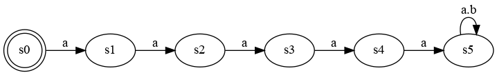

# The Clock Constraint Specification Language

[Main](../Readme.md)

## Binary Delay

[src](../lc/BinaryDelay.lc) [simul](../vcd/BinDelay.html)

- The binary delay is a synchronous constraints that delay the ticks of a clock of some steps. If `b = a $ n`, **b** is synchronous with **a** starting from its nth tick. As a consequence **b** is slower than **a** or equal if **n=0**.

 
<strong> b = a $ 5</strong> 

