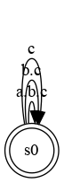

# The Clock Constraint Specification Language

[Main](../Readme.md)

## Exclusion

[src](../lc/Exclusion.lc) [simul](../vcd/Exclusion.html)

- **Exclusion** forbids n clocks to tick simultaneously pair-wise.

 
<strong>a # b # c</strong> 

