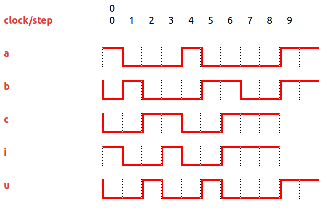

# The Clock Constraint Specification Language

[Main](../Readme.md)

## Infimum and Supremum (for causality)

[src](../lc/InfSup.lc) [simul](../vcd/InfSupDemo.html)

- The **infimum** of n clocks `{c_1, ..., c_n}` is the slowest clock that is faster than all of the clocks **c_i**.
- The **supremum** of n clocks `{c_1, ..., c_n}` is the fastest clock that is slower than all of the clocks **c_i**.

 
<strong> u = sup(a,b,c) i = inf(a,b,c)</strong> 

