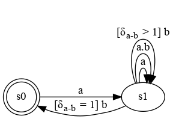
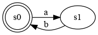
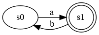

# The Clock Constraint Specification Language

[Main](../Readme.md)

## Precedence

[src](../lc/Precedes.lc) [simul](../vcd/prec.html)

- **Precedence** is an asynchronous primitive that forces one clock to precede another one, it will therefore remain ahead or in advance. It is akin of an infinite FIFO with blocking read. 

 
<strong>a < b : </strong>a precedes b 

- The Bounded precedence limits the size of the FIFO with a *max* value and can also initialize the value with an *init* amount of tokens;

<table>
<tr>
<th align="center"><strong>a < (max:1) b</strong></th> 
<th align="center"><strong>a < (init:1 max:1) b</strong></th>
</tr>
<tr>
<td></td>
<td></td>
</tr>
<tr>
<td align="center"><a href="../lc/Alternates.lc">src</a>
<td align="center"><a href="../lc/AlternatesInit.lc">src</a>
</tr>
</table>

