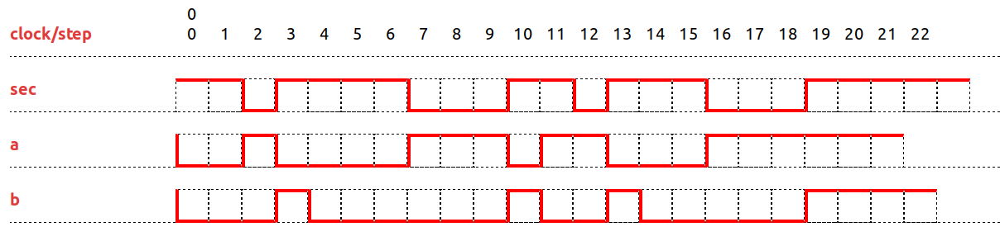

# The Clock Constraint Specification Language

[Main](../Readme.md)

## SampledOn

[src](../lc/SampledOn.lc) [simul](../vcd/SampledOnDemo.html)

- **SampledOn** synchronizes a clock **a** on a clock **sec**.

<table>
<tr>
<td width=20%></td>
<td width=70%></td>
</tr>
<tr>
<th>b = a sampledOn sec</th><th>b is a sampled on sec</th>
</tr>
</table>
