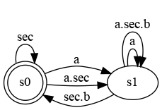

# The Clock Constraint Specification Language

[Main](../Readme.md)

## SampledOn

[src](../lc/SampledOn.lc) [simul](../vcd/SampledOn.html)

- **SampledOn** synchronizes a clock **a** on a clock **s**.

 
<strong>a = b $ 1 on s </strong> a is b sampled on s

