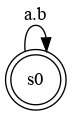
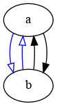

# The Clock Constraint Specification Language

[Main](../Readme.md)

## Synchrony

[src](../lc/Synchrony.lc) [simul](../vcd/Synchrony.html)

- When a is a subclock of b and b a subclock of a, then a and b are **synchronous**. When a causes b and b causes a then a and b are also **synchronous**.

<table>
<tr><td align="center"></td><td width="25%"></td>
<td align="center"></td></tr>
<tr><th align="center">a is subclock of b</th><td width="25%" align="center">and</td><th align="center">b is subclock of a</th></tr> 

