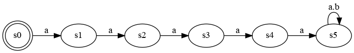

# The Clock Constraint Specification Language

[Main](../Readme.md)

## Ternary Delay

[src](../lc/TernaryDelay.lc) [simul](../vcd/TernaryDelay.html)

- The ternary delay is akin to a shift register (for events) that has a sampling effect.
- When writing `b = a $ n on sec`, **a** is sampled on **sec** and then delayed on **sec**. So **b** is a subclock of **sec**, while **a** may not be. It adapts a system from the speed of **a** to the speed of **sec**. When **a** is to fast, then some occurrences are lost, when **sec** is too fast, then nothing happens most of the time (hence the sampling effect).
- Note: `b is subclock of sec`, `a &le; b`

<!--

 
<strong> b = a $ 5</strong> 

-->
