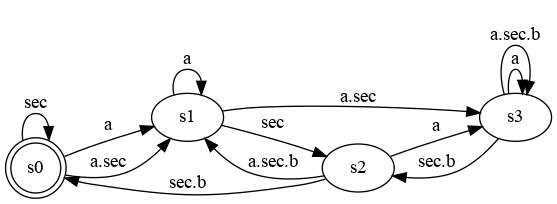

# The Clock Constraint Specification Language

[Main](../Readme.md)

## Ternary Delay

[src](../lc/TernaryDelay.lc) [simul](../vcd/TernaryDelay.html)

- The ternary delay is akin to a shift register (for events) that has a sampling effect.
- When writing `b = a $ n on sec`, **a** is sampled on **sec** and then delayed on **sec**. So **b** is a subclock of **sec**, while **a** may not be. It adapts a system from the speed of **a** to the speed of **sec**. When **a** is to fast, then some occurrences are lost, when **sec** is too fast, then nothing happens most of the time (hence the sampling effect).
- Notes: 
    - `b is subclock of sec`, `a &le; b`
    - if `n=0` then `b=a`
    - if `n=1` then `b=a sampledOn sec`
    - if `sec=a` then `b=a$n`

<table>
<tr>
<td width="25%">
  <table>
    <tr>
      <td width="40%" align="center"></td>
      <td width="60%"></td>
    </tr>
  </table>
</td>
<td width=30%></td>
<td width=40%></td>
</tr>
<tr>
  <td>
    <table>
      <tr><th>b = a $ 0 on sec b = a $ 0</th><th> b = a $ 1 on sec b = a sampledOn sec</th></tr> 
     </table>
  </td>
  <th> b = a $ 2 on sec</th> 
  <th> b = a $ 3 on sec</th> 
</tr>
</table>

