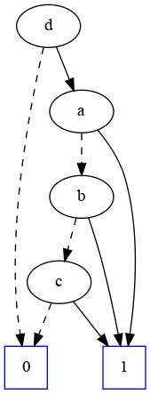

# The Clock Constraint Specification Language

[Main](../Readme.md)

## Union and Intersection

[src](../lc/Union.lc) [simul](../vcd/UnionIntersection.html)

- **Union** and **Intersection** are two synchronous constraints that act as supremum and infimum for the subclock relation. **a + b** (union) is the slowest clock that is a superclock of both *a* and *b*. **a * b** (intersection) is the fastest clock that is a subclock of both *a* and *b*.
 

 
<strong> u = d * (a + b + c)</strong> 

