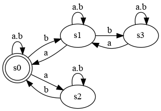
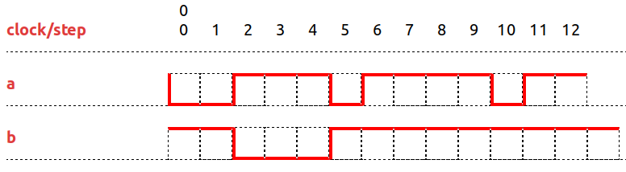

# The Clock Constraint Specification Language

[Main](../Readme.md)

## Causality

[src](../lc/BoundedCausality.lc) [simul](../vcd/BoundedCausalityDemo.html)

- **Causality** is a weakest form of [precedence](Precedence.md) that allows for a and b to tick exactly at the same rhythm, an unbounded FIFO. The bounded form restricts the advance that a can have over b (a bounded FIFO of size max). Init allows for initializing the FIFO with an initial number of tokens, relaxing the constraint doing so.

<table>
<tr>
<td width=20%></td>
<td width=70%></td>
</tr>
<tr>
<th>a <= (init: 2 max: 3) b</th><th>a causes b</th>
</tr>
</table>
