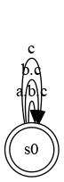

# The Clock Constraint Specification Language

[Main](../Readme.md)

## Subclock

[src](../lc/Subclocking.lc) [simul](../vcd/subclocking.html)

- **Subclock** is the basic synchronous clock (partial binary) relation that forbids a *subclock* to tick when its *superclock* cannot tick. Subclock does not say when the subclock or the superclock should tick, only when the subclock cannot tick. Other forms of constraints are used to built subclock with precise repetitive ticking patterns.

<table>
<tr><td align="center"></td><td width="25%"></td>
<td align="center"></td></tr>
<tr><th align="center">a is subclock of b</th><td width="25%" align="center">and</td><th align="center">b is subclock of c</th></tr> 

