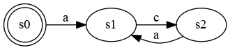
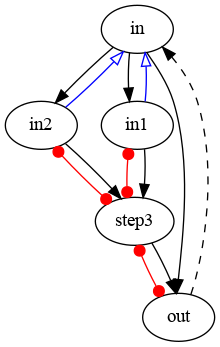
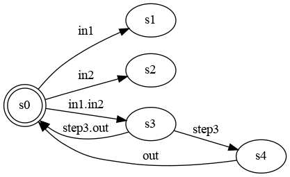
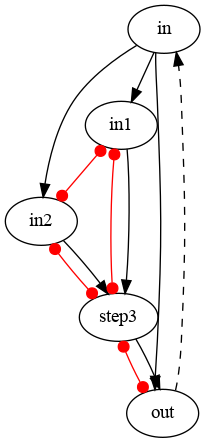
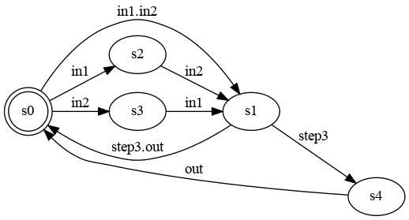

# Example from SCP 2015

- Mallet, F. and de Simone, R. Correctness issues on MARTE/CCSL constraints. Sci. Comput. Program. 106, 78–92, 2015. [DOI](https://doi.org/10.1016/j.scico.2015.03.001)

## Safe composition of unsafe constraints
The composition of unsafe constraints may result in a safe result.

- Example : **Alternation** [[src]](lc/alt.lc)
  

## Safe specification with bad paths

The safety can be analyzed using Causality Clock Graphs. See 

- Mallet, F., Millo, J.-V., and de Simone, R. [Safe CCSL specifications and marked graphs](http://ieeexplore.ieee.org/xpl/freeabs_all.jsp?arnumber=6670955). *11th ACM/IEEE Int. Conf. on Formal Methods and Models for Codesign*, IEEE, 157–166, 2013.

In the graph below, the red arcs represents the source of unboundness. Since all the red arcs are in a strongly connected components with respect to the causality relation, the specification is safe.

However, despite being safe, there are some bad paths (akin to liveness problems). See s1 and s2 below.

- Example : safe specification with bad paths [[src]](lc.scp15_v3b.lc)

## Safe and live specifications

Luckily some specifications can be both safe and live.

- Example : safe and live specification  [[src]](lc.scp15_v1b.lc)

