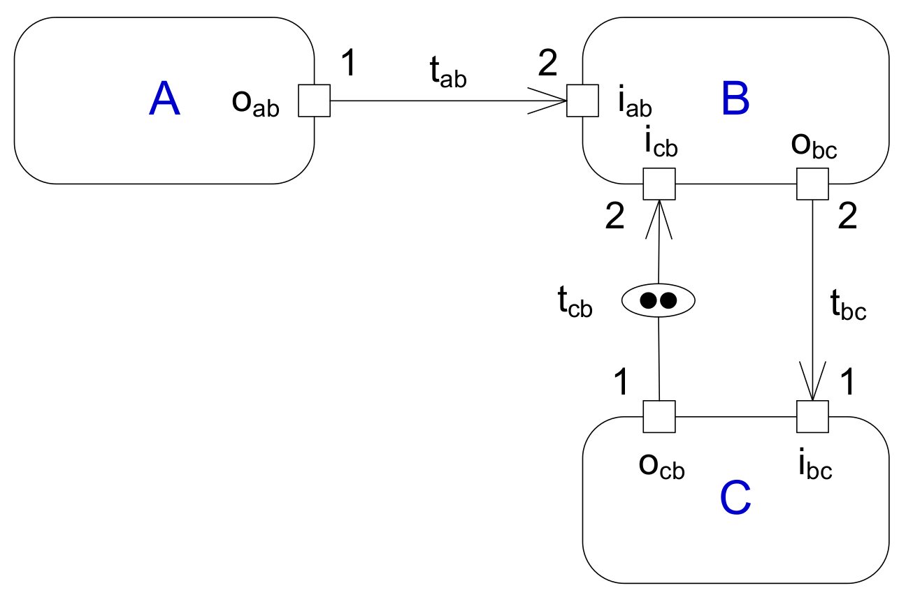

# Synchronous DataFlow (SDF) with CCSL

This example uses subspecifications 

[src](lc/sdf.lc)

Initially discussed at the **UML and Formal Methods** workshop during ICFEM 2009, it was then published in :
- Mallet, F., DeAntoni, J., André, C., and de Simone, R. 2010. The Clock Constraint Specification Language for building timed causality models. Innovations in Systems and Software Engineering 6, 1–2, 99–106. [DOI](https://link.springer.com/article/10.1007/s11334-008-0055-2)

The CCSL encoding captures the minimal asynchronous semantics of [SDF](https://ptolemy.berkeley.edu/publications/papers/87/synchdataflow/) and does not (unless explicitly required) enforce an optimal synchronous execution. A more efficient encoding (not one-to-one) was then proposed in :
- Glitia, C., DeAntoni, J., and Mallet, F. 2010. [Logical Time at Work: Capturing Data Dependencies and Platform Constraints](https://doi.org/10.1049/ic.2010.0159). FDL, ECSI, Electronic Chips & Systems design Initiative, 241–248. 

