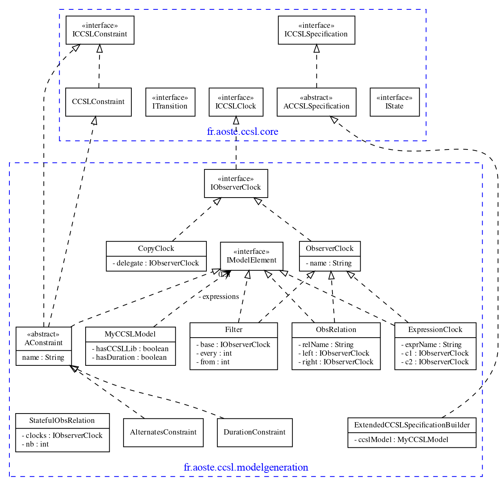

# ccsl-core

**Author:** F. Mallet

**Date:** 2014

[ccsl.core](src/fr/aoste/ccsl/core) and [ccsl.system](../ccsl-system.src/fr/aoste/ccsl/system) are two separate encodings for CCSL specification. One uses heavy data structures (like lists) the other one just uses strings and do not assume a concrete type.

ccsl.adapter adapts a ccsl.core.ICCSLSpecification as a ccsl.system.ICCSLSystemBuilder

## fr.aoste.ccsl.core

**Source:** [fr.aoste.ccsl.core](src/fr/aoste/ccsl/core/)

Main abstract definition of a [CCSL Specification](src/fr/aoste/ccsl/core/ICCSLSpecification.java). Since 2014, a new model is proposed with ISimpleSpecification. See fr.inria.aoste.timesquare.safety.core on TimeSquare repository.

This structure is still in used for STS-based representations.

Most of the time we try not to serialize the model but to deal with it on-the-fly.
When Serialization is required, fr.aoste.ccsl.basic proposes a basic generic implementation

## fr.aoste.ccsl.modelgeneration

**Source:** [fr.aoste.ccsl.modelgeneration](src/fr/aoste/ccsl/modelgeneration/)

Data Structure to encode a [CCSL Specification](src/fr/aoste/ccsl/core/ICCSLSpecification.java) in a [MyCCSLModel](src/fr/aoste/ccsl/modelgeneration/MyCCSLModel.java). Mainly used to produce a .extendedCCSL file.

## Architecture
 

<strong>Architecture</strong>

