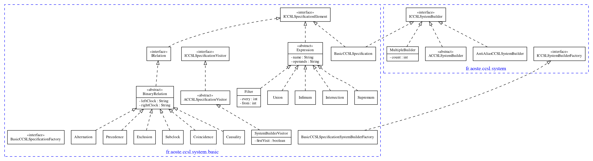

# ccsl-core

**Author:** F. Mallet

**Date:** 2014

<strong>Architecture</strong>

- **ccsl.core** and **ccsl.system** are two separate encodings for CCSL specifications. One uses heavy data structures (like lists) the other one just uses strings and do not assume a concrete type.
- **ccsl.adapter** adapts a [ccsl.core.ICCSLSpecification](../ccsl-core/src/fr/aoste/ccsl/core/ICCSLSpecification.java) as a 
[ccsl.system.ICCSLSystemBuilder](src/fr/aoste/ccsl/system/ICCSLSystemBuilder.java)

## fr.aoste.ccsl.system

**Source:** [fr.aoste.ccsl.system](src/fr/aoste/ccsl/system)

ccsl.core relies on complex data structure. ccsl.system uses String for clocks and do not assume a concrete class.

## fr.aoste.ccsl.system.basic

**Source:** [fr.aoste.ccsl.system.basic](src/fr/aoste/ccsl/system/basic)

Basic and generic data structure for serialization and visit of a [ICCSLSystemBuilder](src/fr/aoste/ccsl/system/ICCSLSystemBuilder.java). It will build a [BasicCCSLSpecification](src/fr/aoste/ccsl/system/basic/BasicCCSLSpecification.java).

In many cases, this data structure is not appropriate and the operation is done on the fly or with an adequate data structure.
