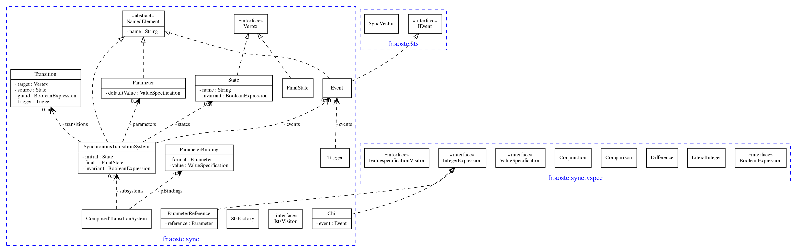

# sts-pojo

**Author:** F. Mallet

**Date:** 2014

- Dependency : uses **common-binaryword** to encode the synchronization vectors as binary words (binaryWord-0.1.jar)

## src-texo

**Source:** [src-texo](src-texo/fr/aoste/sync/SynchronousTransitionSystem.java)

Abstract Data Type to represent Synchronous Transition Systems (STS). It was generated from .ecore by Texo. Gives a concrete data structure to represent transition systems.

 
<strong>Static view of STS</strong>

 
<strong>Dynamic view of STS</strong>

## src

Gives some algorithms to compose, execute
- composition : [STSParallelComposer](src/fr/aoste/sync/compose/STSParallelComposer.java)
- execute : [DTSRunner](src/fr/aoste/sync/dynamic/util/DTSRunner.java)
- reduce : Using [AInvariantHelper](src/fr/aoste/sync/linearprogramming/AInvariantHelper.java)

Some reductions requires to use solvers. Several external "plugins" use different solvers to reduce.
When no plugin is activated, the composition algorithm only use reachability to compute possibly reachable states without interpretation of the guards on transitions or state invariants. See [DefaultInvariantHelper](src/fr/aoste/sync/linearprogramming/DefaultInvariantHelper.java).

Other invariant helpers were implemented:
- CplexInvariantHelper (based on CPlex). It requires a license of CPlex.
- JalinoptInvariantHelper : not functional any longer
- ChocoInvariantHelper : Developed in 2020 (see fr.kairos.sts.pojo.choco)

