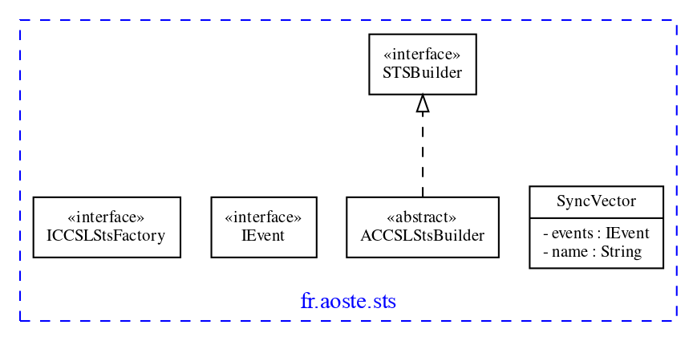

# sts

**Author:** F. Mallet

**Date:** 2014

 
<strong>Architecture</strong>

## fr.aoste.sts

**Source:** [fr.aoste.sts](src/fr/aoste/sts)

Abstract Data Type to represent Synchronous Transition systems.

There are two concrete implementations:
- One generated by EMF that requires Eclipse Modeling and EMF facilities
- One generated from .ecore by Texo that is pure old java code (POJO) - see [sts.pojo](../sts-pojo/Readme.md)